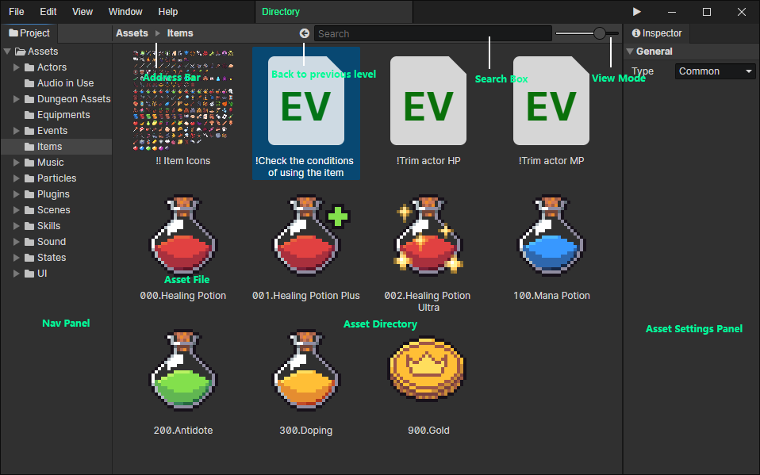

# File Browser

- Nav Panel：Quickly switch between folders
- Address Bar：You can return to the previous level of the directory
- Search Box：Searching files allows you to enter a file extension to find all files of the same type (e.g. item has the extension .item), and you can view the file extension by selecting the file -> Right-click menu -> Show in Explorer. Also, typing "." in the search box You can search all available files, this method is commonly used when selecting fixed types of files, for example, when selecting an actor file, typing "." to display all actors.
- View Mode：At 100% screen zoom, the five view modes are 16px list, 32px tiled, 64px tiled, 128px tiled and 256px tiled from left to right.
- Asset Directory：Press Ctrl+left mouse button to multi-select or deselect files, press Shift+left mouse button to select multiple files in a row, press "Back mouse button" or "Backspace" in "Asset directory" to return to the previous level of the directory.

:::tip

In the file browser, you can change the name and path of a file as you like without causing an asset file path error. This is because: each file name contains a GUID (16 characters), but the GUID in the file name is hidden in the editor, and you can view the GUID in Explorer.

What happens if there are multiple files using the same GUID? 
Only one file will be shown in the editor, other files with duplicate GUIDs will be hidden. Will be implemented in a future update: remind the user which files have conflicting GUIDs.

:::