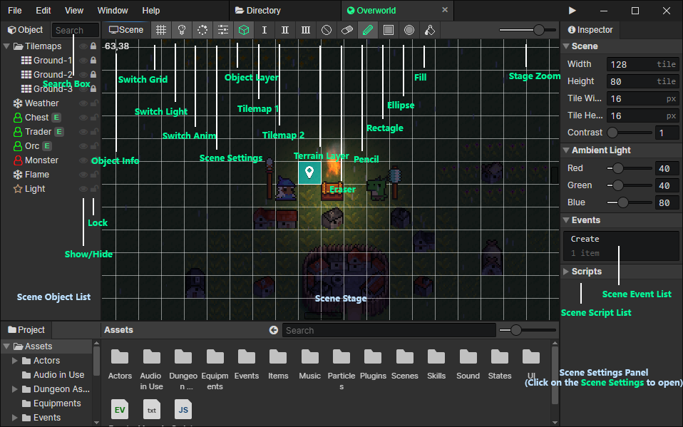

# Scene

### Scene Object List

- Search Box：Enter keywords to search for scene objects, press Escape to clear the search content, and press "Back Mouse Button" or "Backspace" in the list to get the same effect.
- Show / Hide：You can hide the scene object that you don't want to see
- Lock：Locked objects are not selectable, you can lock large objects such as tilemaps, parallaxs, etc. to avoid misuse

### Scene Stage

- Object Info：Display information about the selected scene object, or the coordinates of the mouse location
- Switch Grid：Render the scene grids when enabled
- Switch Light：Render ambient light and light sources when enabled
- Switch Animation：Play animations and particles when enabled
- Scene Settings：Open the scene settings panel on the right
- Object Layer：Scene objects can be selected
- Tilemap 1：Edit the tilemap with shortcut 1 bound
- Tilemap 2：Edit the tilemap with shortcut 2 bound
- Terrain Layer：Set the obstacle area of the scene
  - Land：Actors with "land" or "unrestricted" passage terrain can move here
  - Water：Actors with "water" or "unrestricted" passage terrain can move here
  - Wall：Actors with "unrestricted" passage terrain can move here, can block "trigger" (bullet) objects from passing through
- Eraser：Erase tiles from the tile map being edited
- Pencil：Draw tiles into the tile map
- Rectangle：When editing the tilemap, you can batch draw tiles into rectangular areas by dragging and dropping
- Ellipse：When editing the tilemap, you can batch draw tiles into ellipse areas by dragging and dropping
- Fill：When editing the tilemap, replace all connected identical tiles around a tile with the specified tile
- Stage Zoom：From left to right, the five scaling levels are 25%, 50%, 100%, 200% and 400%.

### Scene Settings Panel

- [Click to jump](/docs/inspectors/scene/scene-settings)