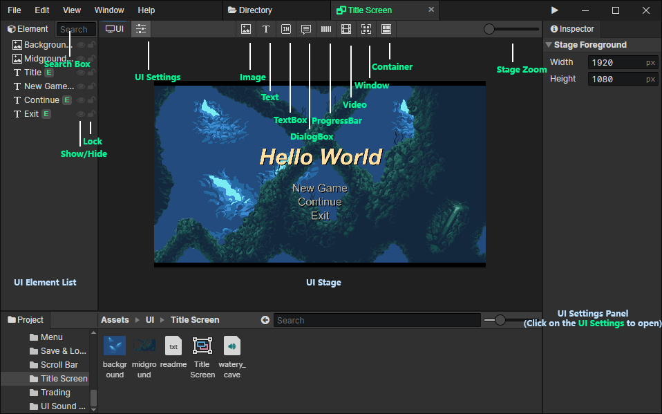

# UI

### UI Element List

- Search Box：Enter keywords to search for ui elements, press Escape to clear the search content, and press "Back Mouse Button" or "Backspace" in the list to get the same effect.
- Show / Hide：You can hide the ui element that you don't want to see
- Lock：Locked elements are not selectable, you can lock large objects such as tilemaps, parallaxs, etc. to avoid misuse

### UI Stage

- UI Settings：Open the ui settings panel on the right
- Image：The element that displays an image file
- Text：Rich text tags can be used
- Text Box：Text Box allows the user to enter text
- Dialog Box：Dialog Box can print text one by one
- Progress Bar：Visualize the progress of 0 ~ 1
- Video：Video files can be played
- Window：You can set the grid layout for the window child elements
- Container：Used to nest other elements
- Stage Zoom：From left to right, the five scaling levels are 25%, 50%, 100%, 200% and 400%.

### UI Settings Panel

- [Click to jump](/docs/inspectors/ui/ui-settings)