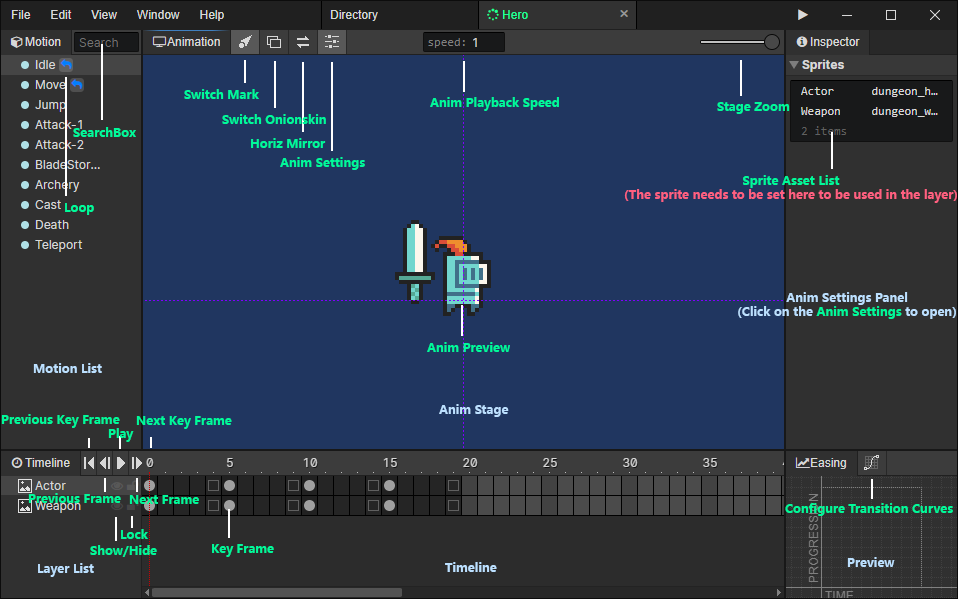

# Animation

### Motion List

- Search Box：Enter keywords to search for motions, press Escape to clear the search content, and press "Back Mouse 

### Animation Stage

- Switch Mark：Show or hide marker patterns such as joints, particles.
- Switch Onionskin：Show semi-transparent sprites of the previous and next frames of the current frame when turned on
- Horizontal Mirror：Flip the animation in the stage horizontally with the Y axis as the symmetry axis
- Animation Settings：Open the animation settings panel on the right
- Playback Speed：Animation playback speed during preview, you can reduce the speed to see the details, not affected when running the game.
- Stage Zoom：From left to right, the five scaling levels are 25%, 50%, 100%, 200% and 400%.

### Animation Settings Panel

- [Click to jump](/docs/inspectors/animation/animation-settings)

### Layer List

- Show / Hide：You can hide the animation layers you don't want to see
- Lock：Keyframes in locked layers cannot be selected to avoid misuse

### Timeline

- Previous keyframe：Jump to the previous keyframe of the current frame
- Next keyframe：Jump to the next keyframe of the current frame
- Previous frame：Jump to the previous frame of the current frame
- Next frame：Jump to the next frame of the current frame
- Play / Pause：If the animation is paused, play the animation, otherwise pause it
- Keyframe：When selected, you can set the animation frame parameters

### Easing

- Configure transition curves：Open the "Easing" Window