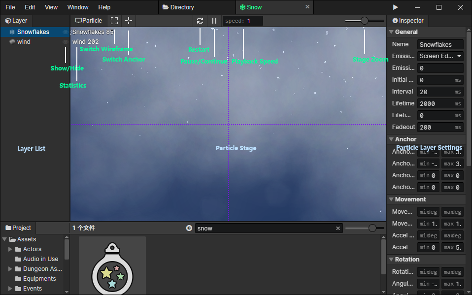

# Particle

### Particle Layer List

- Show / Hide：You can hide the particle layers that you don't want to see

### Particle Stage

- Statistics：Real-time display of how many particles are in each layer of the stage
- Switch Wireframe：When on, render the rectangular wireframe of the particle element
- Switch Anchor：When on, render the anchor point of the particle element (red cross), and the line from the anchor point to the center of the particle (green line)
- Pause / Continue：Freeze the particles in the stage and click again to continue playing
- Playback speed：Particle playback speed during preview, you can reduce the speed to see the details, not affected when running the game
- Stage Zoom：From left to right, the five scaling levels are 25%, 50%, 100%, 200% and 400%.

### Particle Layer Settings Panel

- [Click to jump](/docs/inspectors/particle/particle-layer)