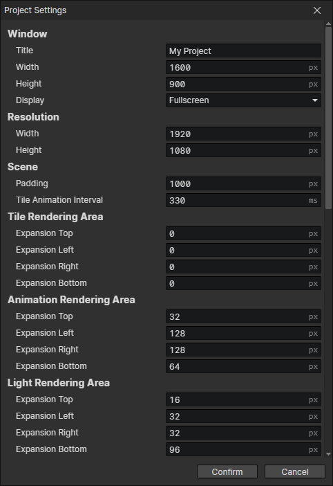
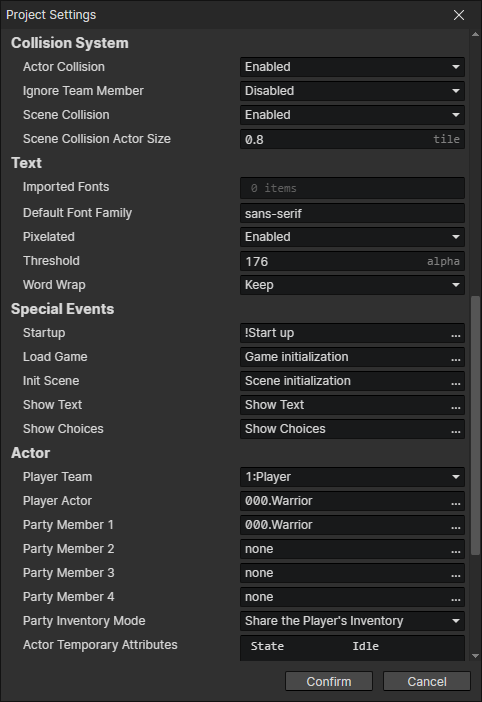
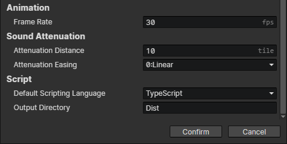

# Window - Project Settings

### Window

- Title：Title of the game window
- Width：The width of the game window, maximization and fullscreen mode are not affected
- Height：The height of the game window, maximization and fullscreen mode are not affected
- Display：Window, maximized, fullscreen

### Resolution

- Width：The actual width of the game canvas, which is automatically scaled by the window size
- Height：The actual height of the game canvas, which is automatically scaled by the window size

### Scene

- Padding：The maximum visible distance outside the grid for all scenes. padding = 0 means that the camera is locked into the valid area and does not show the area outside the scene. (The exception is when the scene size is too small and the valid area is displayed centered)
- Tile Animation Interval：Duration of each animation frame of the autotile

### Tile Rendering Area

- Expansion Top：Expanding the tile rendering area upwards
- Expansion Left：Expand the tile rendering area to the left
- Expansion Right：Expand the tile rendering area to the right
- Expansion Bottom：Expand the tile rendering area downward

:::tip

When the four expansions are set to 0, the tile rendering range is the entire visible area inside the screen for optimization reasons  
When you use a tile that exceeds the size of the scene grid, it is possible that the grid it is on is off-screen and therefore not rendered  
For example, a 4x3 tree as a tile, and its tile position is just outside the screen below  
Expand the tile rendering area to show large tiles off-screen  
In general: expansion bottom > expansion left = expansion right > expansion top, the smaller the rendering area the better the performance

:::

### Animation Rendering Area

- Expansion Top：Expanding the animation rendering area upwards
- Expansion Left：Expand the animation rendering area to the left
- Expansion Right：Expand the animation rendering area to the right
- Expansion Bottom：Expand the animation rendering area downward

:::tip

When the four expansions are set to 0, animations with anchor points inside the screen are rendered  
Expand the animation rendering area to show animations outside the screen  
Adjust to the appropriate rendering range according to the sizes of the animations

:::

### Light Rendering Area

- Expansion Top：Expanding the light rendering area upwards
- Expansion Left：Expand the light rendering area to the left
- Expansion Right：Expand the light rendering area to the right
- Expansion Bottom：Expand the light rendering area downward

:::tip

When the four expansions are set to 0, the light source and ambient light are rendered to the visible area inside the screen  
If an actor sampling light from the anchor point is standing below the screen, he will only have the upper half of his body visible and will not be able to sample light from the bottom of his feet  
Expanding the light rendering area allows you to sample light from outside the screen for color compositing

:::

### Collision System

- Actor Collision：If enabled, automatically separate actors based on actor collision size
- Ignore Team Member：If enabled, there will be no actor collision between actors of the same team
- Scene Collision：If enabled, actors cannot enter other obstacle areas. For example, actors moving on the ground cannot enter water and wall blocks
- Scene Collision Actor Size：When colliding with the scene, the actor is treated as a circle, and the diameter of the circle is used as the collision size

### Text

- Imported Fonts：External fonts can be imported, the file name (without extension) is the font name
- Default Font Family：Default font used for text, textbox, dialogbox elements
- Pixelated：If enabled, all text in the game will be rendered as pixelated text, with the parameter (threshold) enabled
- Threshold：Pixels with text edge opacity less than the threshold (1~255) are discarded, and all remaining pixels become completely opaque
- Word Wrap
  - Break：Apply to Chinese, Japanese, Korean, force break when auto line feed
  - Keep：Suitable for English, etc., keep the complete word when auto line feed

### Special Events

- Startup：The event that is automatically called when the game is run
- Load Game：The event that is automatically called at the end of loading savedata, which can be used to restore the UI
- Init Scene：The Event that is automatically called when a scene is loaded
- Show Text：The event automatically called by "Show Text" command, which can be used to customize the dialog box
- Show Choices：The event automatically called by "Show Choices" command, which can be used to customize the choice interface

### Actor

- Player Team：For initial "player actor" and "party member"
- Player Actor：The global actor created automatically at game initialization and set him as the "player actor"
- Party Member 0：The global actor automatically created at game initialization, set as the first member of the player's party
- Party Member 1：The global actor automatically created at game initialization, set as the second member of the player's party
- Party Member 2：The global actor automatically created at game initialization, set as the third member of the player's party
- Party Member 3：The global actor automatically created at game initialization, set as the fourth member of the player's party
- Party Inventory Mode
  - Share the player's inventory：Party members use the initial player actor's inventory and revert to their own inventory when they leave the party
  - Use separate inventorys：Party members use their own inventory
- Actor Temporary：All actors are automatically added with preset temporary attributes when they are initialized, these attributes cannot be saved and are reset after loading savedata

:::tip

"Player actor" will not be automatically added to the team, you can set the same actor as "Player actor" and "Party member"  
If you want to deselect team members, you can deselect the file by Ctrl+click on the actor file or click on the blank space

What is a global actor?  
A global actor is different in that it can be saved permanently. When a global actor is deleted via the "Delete Actor" event command, it does not really disappear, but is put into the background and waits for its next appearance. A normal actor, on the other hand, disappears forever when it is deleted or when the scene is destroyed.

:::

### Animation

- Frame Rate：The number of frames per second that the animation timeline plays, while the actual number of frames rendered is related to the FPS.

### Sound Attenuation

- Attenuation Distance：When playing "Attenuated sound effects", if the camera center is at the same position as the sound source, the volume is 1, if the distance between the camera center and the sound source ≥ attenuation distance, the volume is 0

### Script

- Default Scripting Language
  - JavaScript：Create a new script file with ".js" extension
  - TypeScript：Create a new script file with ".ts" extension and enable parameter (Output Directory)
- Output Directory：When running the game, the js file compiled by ts will be loaded in the specified directory, but the editor will not automatically compile ts. Suppose Assets/dir/script.ts exists and the compiled output directory is Dist, it will try to load Dist/dir/script.js