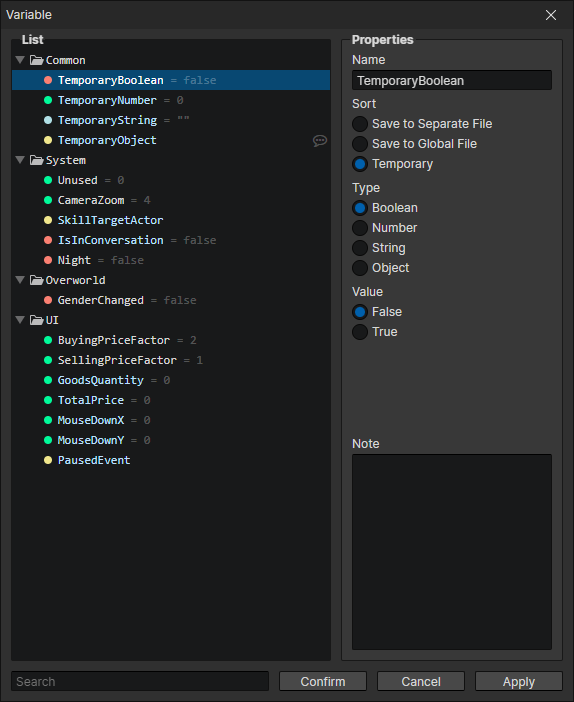

# Window - Global Variables

### Variable List

Folders and variables can be created here, each with a unique ID that can be viewed or copied by opening the right-click menu.
- Search Box：Search for variables with matching keywords. After selecting the search results, you can press the "back mouse button" in the list to clear the search content.

### Properties

- Name：The name of the variable displayed in the editor
- Sort
  - Save to separate file：When saving the game, variable data is written to the archive.
  - Save to global file：Variable data is written to the global archive when you exit the game, and the global archive is automatically read when you start the game.
  - Temporary：Variable data will not be saved, revert to initial value when resetting the game, enable variable type (object)
- Type
  - Boolean：Two simple states can be written: true and false
  - Number：Supports integers and decimals, can be used to write multiple states, such as 0, 1, 2, 3... represent different stages of a quest
  - String：It can be used to write the name or to write the state, it is easier to understand by using text as the state, such as "open", "closed"
  - Object：The object can be an actor, skill, item, equipment, element, list, etc. Since the object cannot be saved, it can only be written to a temporary variable
- Initial Value：Depending on the type of variable, different input boxes will appear
- Note：You can record what this variable does, or what state values are available in total, to avoid forgetting