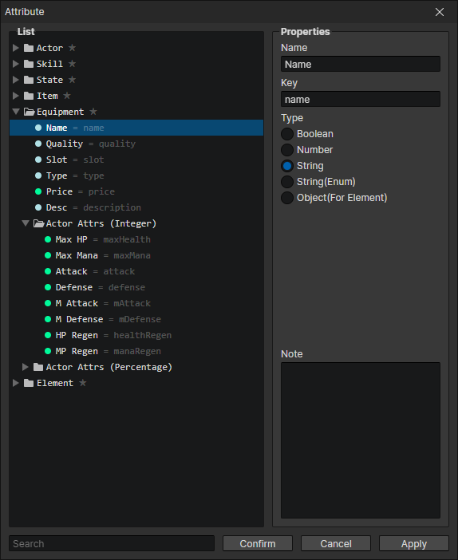
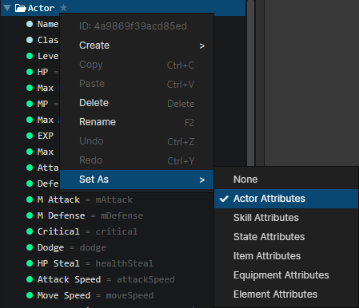
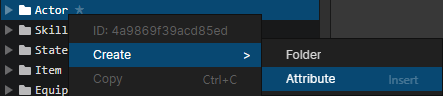

# Window - Object Attribute

### Attribute List

Folders and properties can be created here, each with a unique ID, which can be viewed or copied by opening the right-click menu

- Search Box：Search for attributes with matching keywords. After selecting the search results, you can press the "back mouse button" in the list to clear the search content.

### Properties

- Name：The name of the attribute displayed in the editor
- Key：The actual name of the attribute in the program, accessible via script, or if left blank the attribute ID will be used as the key
- Type
  - Boolean：Two simple states can be written: true and false
  - Number：Supports integers and decimals
  - String：Can write name, description, etc.
  - String (enumeration)：You can specify an enumeration folder as a set of string options to make it easier to modify string values uniformly
  - Object (for element)：The object can be an actor, skill, item, equipment, element, list, etc. Since the object cannot be saved, it can only be written to a temporary variable as an element attribute
- Note：You can record what this attribute does to avoid forgetting

### Context Menu - Set As

Select a folder and open the "context menu -> Set as" to set the attributes of this folder (including subfolders) to the attribute list of the specified object type  
For example, if you set it to actor attributes, you can add all the attributes in this folder to the attribute list in the actor panel

### Context Menu - Create

New custom attributes can be added by right-click menu -> create -> attribute