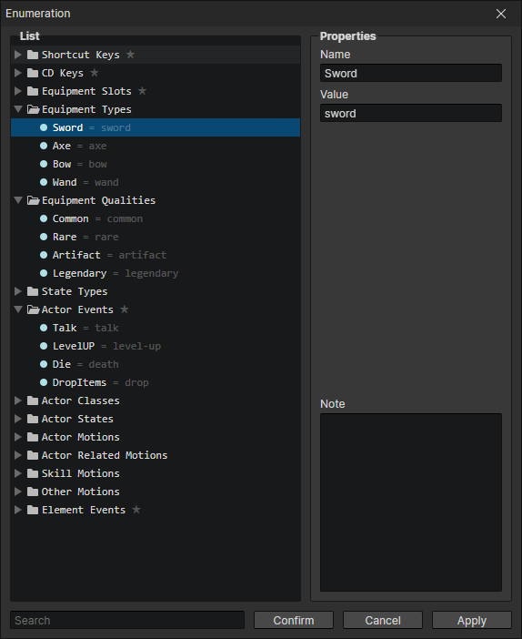
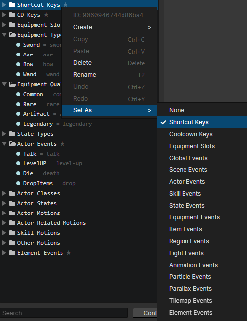
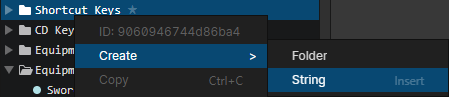

# Window - Enumeration

### Enumeration List

Folders and enumeration strings can be created here. Each folder and enumeration string has a unique ID that can be viewed or copied by opening the right-click menu.

- Search Box：Search for enumerations with matching keywords. After selecting the search results, you can press the "back mouse button" in the list to clear the search content.

### Properties

- Name：The name of the enumeration displayed in the editor
- Value：The value of the enumeration in the program, accessible through the script, if not filled in, the enumeration ID will be used as the value
- Note：You can write down the role of the folder or enumeration string to avoid forgetting

### Context Menu - Set As

Select a folder, open the "context menu -> set as", you can set the enumerations of this folder (including subfolders) for various purposes such as custom events  
For example, if you set it to actor events, the actors can use all the custom events in this folder. Custom events can be executed by "Call Event" command, or can be called in the plugin

### Context Menu - Create

You can add a new enumeration string by right-click menu -> create -> string