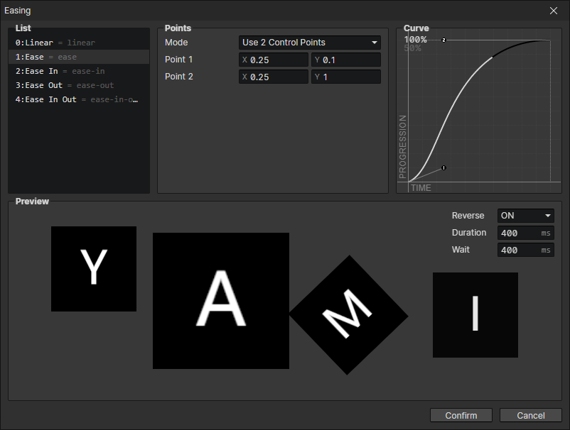

# Window - Easing

### Easing List

You can insert new transition curves via the right-click menu, set the key for the transition curve ( = linear), and get the transition curve in the script via the key.  
Transition curves can be switched in any order, you can set the usual curve as the first one, which will be selected by default in some input boxes.

### Control Points

- Mode：Optional 2/5/8 control points
- Point：Adjust the transition curve by setting the (X, Y) coordinates of the control point

### Curve

X-axis is the time (0~1), Y-axis is the progress (0~1), you can change the shape of the curve to control the speed of the object moving in a certain time  
Click 100%/50% in the upper left corner to change the scaling ratio

### Preview

- Reverse：If turned on, playback will be reversed at the end.
- Duration：Duration of a single transition
- Wait：Waiting time after the end of the transition
