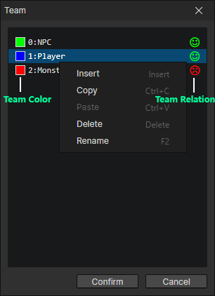

# Window - Team

### Team List

New teams can be inserted via the right-click menu  
Teams can be switched in any order, you can set your usual team as the first one, which will be selected by default in some input boxes

- Team Color：Click on the color box to edit the team's color, which can be previewed in the scene.
- Team Relation：The relationship between the selected team and other teams, green smiley face = friendly, red angry face = hostile