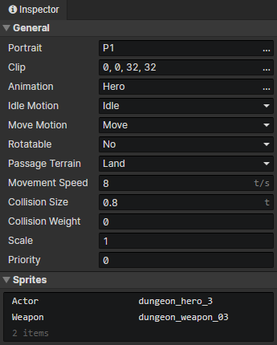
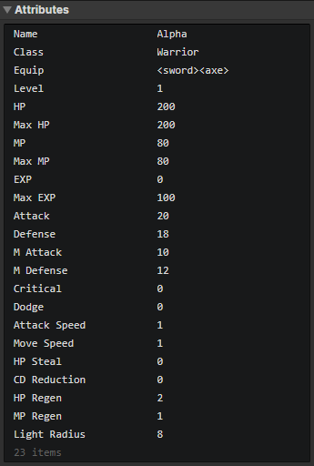
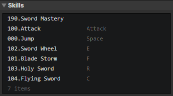
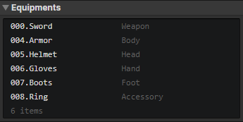
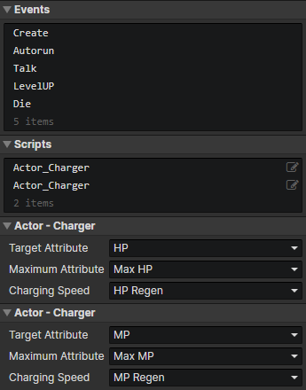

# File - Actor

### General

- Portrait：Actor avatar, loaded into the image element via the "Load Image" command and modified via the "Change Actor Portrait" command.
- Clip：If you put different expressions or multiple portraits of an actor into one picture, you can crop the specified rectangular area, which can be changed with "Change Actor Portrait" command.
- Animation：Actor animation, modified via the "Change Actor Animation" command
- Idle Motion：The animation motion that plays automatically when the actor is idle, modified via the "Change Actor Motion" command
- Move Motion：The animation motion that plays automatically when the actor is moving, modified via the "Change Actor Motion" command
- Rotatable：When turned on, the animation rotation angle is affected by the current angle of the actor, which can be used for top view games
- Passage Terrain
  - Land：The actor can only move on land
  - Water：The actor can only move in the water
  - Unrestricted：The actor can move on land, in water, in walls
- Movement Speed：The initial movement speed of the actor, modified via the "Set Movement Speed" command
- Collision Size：Square side length for actor-to-actor collisions
- Collision Weight：Actor collision-related property, modified via the "Set Weight" command
  - When weight = 0, the actor's collision is ignored
  - When the weight of actor A : the weight of actor B = 1 : 1, the movement speed of A pushing B is 50%.
  - When the weight of actor A : the weight of actor B = 1 : 2, the movement speed of A pushing B is 0%.
  - When the weight of actor A : the weight of actor B = 2 : 1, the movement speed of A pushing B is 100%, there is no resistance at all.
  - You can set the weight of the NPC to the maximum value of 8, which cannot be pushed by others
- Scale：The scaling factor for the actor animation
- Priority：Prioritize actor animations when rendering, so that animations located below will always overlay those above.
  - Priority = -1 means that the sorting position is shifted up by one tile distance, and if the actor is a ground spike, the priority needs to be lowered
  - Priority = 1 means that the sorting position is shifted down by one tile distance, and if the actor is flying, the priority needs to be raised

### Sprites

The sprite image in the actor animation can be replaced, such as hair, clothes, weapons, etc., and multiple actors can share the actor animation.

### Attributes

Support Boolean, Number, String, and Enumeration(String) types.  
Add custom attributes in "Window -> Object Attribute".  
Read or write actor attributes via "Set Boolean", "Set Number", "Set String" commands.

### Skills

Set the actor's initial skills and shortcut keys here.  
Add shortcut keys in Window->Enumeration.  
Related commands: "Change Actor Skill", "Cast Skill".

### Equipments

Set the initial equipments and slots for the actor.  
Add equipment slots in "Window -> Enumeration".

### Events

Access "Event Trigger Actor" in the event to get this actor

- Create：Triggered at actor initialization (once)
- Autorun：Triggered when the actor appears in a scene (including after loading savedata)
- Collision：Triggered when a collision occurs between this actor and another actor. If the weight is 0, no collision occurs. Visit "Target Actor" in the event to get the actor that collided with this actor.
- Hit Trigger：When the actor is hit by a trigger, execute this event, and access "Event Trigger" in the event to get the trigger that collided with this actor.
- Custom Events：Custom events can be called via the "Call Event" command

### Scripts

Add Javascript files to extend this actor