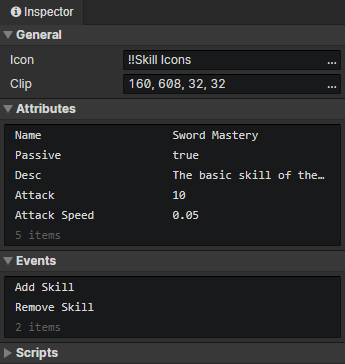

# File - Skill

### General

- Icon：The skill icon, loaded into the image element via the "Load Image" command.
- Clip：Crop the specified rectangular area of the skill icon

### Attributes

Support Boolean, Number, String, and Enumeration(String) types.  
Add custom attributes in "Window -> Object Attribute".  
Read or write skill attributes via "Set Boolean", "Set Number", "Set String" commands.

### Events

Access "Skill Caster" in the event to get the actor that cast this skill  
Access "Event Trigger Skill" in the event to get this skill

- Cast Skill：This event is triggered via the "Cast Skill" command
- Add Skill：Triggered when an actor adds this skill via the "Change Actor Skill" command
- Remove Skill：Triggered when an actor removes this skill via the "Change Actor Skill" command.
- Custom Events：Custom events can be called via the "Call Event" command

### Scripts

Add Javascript files to extend this skill