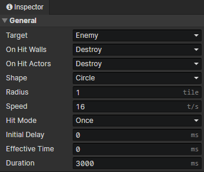
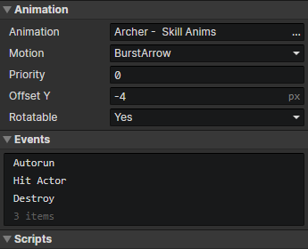

# File - Trigger

### General

- Target：Actor objects that collide with this trigger, and the "Hit Actor" event is executed on collision
  - Enemy：The Actor who is hostile to the skill caster
  - Friend：The Actor who is friendly to the skill caster
  - Team Member：The Actor who is a member of the team of the skill caster
  - Team Member Except Self：The Actor who is a member of the team of the skill caster, but not the skill caster self
  - Any Except Self：Any Actor, but not the skill caster self
  - Any：Any Actor
- On Hit Walls
  - Penetrate：Ignore wall terrain obstruction
  - Destroy：Destroy the trigger when its anchor point enters the inside of the wall
- On Hit Actors
  - Penetrate：The trigger is not affected when it hit an actor
  - Destroy：Destroy the trigger when it hit an actor
  - Destroy After Multiple Hits：After the trigger hits actors a certain number of times, the trigger is destroyed
    - Hit Count：Maximum number of penetrations allowed
- Shape
  - Rectangle：Enable parameters (width, height, anchor)
    - Width：Right = 0 degrees, horizontal length of the trigger shape
    - Height：Right = 0 degrees, vertical length of the trigger shape
    - Anchor：Right = 0 degrees, horizontal position of the trigger connection point, 0 = left, 0.5 = center, 1 = right
  - Circle：
    - Radius：Radius of the trigger shape
  - Sector：
    - Radius：Radius of the trigger shape
    - Central Angle：Angle of the fan shape
- Speed：Initial speed of the trigger
- Hit Mode
  - Once：The "Hit Actor" event is triggered only once for an actor
  - Once On Overlap：The "Hit Actor" event is triggered only once for an actor during the overlap and can be triggered again when the trigger is separated from the actor.
  - Repeat：Trigger multiple "hit actor" events for an actor, enable parameter (hit interval)
    - Hit Interval：After triggering "Hit Actor" event for an actor, wait for a specified time before triggering the event again for that actor
- Initial Delay：The trigger waits for a period of time before entering the active state and then is able to trigger "Hit Actor" event
- Effective Time：The duration of the active state of the trigger. The "Hit Actor" event will not be triggered after the timeout. If set to 0, it means permanently active
- Duration：How long the trigger exists, it will automatically trigger "Destroy Event" after timeout and then be destroyed. If set to 0, it means the trigger will be destroyed at the end of the animation.

### Animation

- Animation：Trigger animation, can be set to "none"
- Motion：One of the motions of the trigger animation
- Priority：Prioritize actor animations when rendering, so that animations located below will always overlay those above.
  - Priority = -1 means that the sorting position is shifted up by one tile distance.
  - Priority = 1 means that the sorting position is shifted down by one tile distance.
- Offset Y：Vertical position offset of the trigger animation
- Rotatable：If turned on, the animation rotates according to the angle of the trigger

### Events

Access "Skill Caster" in the event to get the actor that created this trigger  
Access "Event Trigger Skill" in the event to get the skill that created this trigger  
Access "Event Trigger Actor" in "Hit Actor" event to get the actor that was hit  
Access "Event Trigger Actor" in an event other than "Hit Actor" to get the skill caster

- Autorun：This event is executed automatically when the trigger appears
- Hit Actor：This event is executed when the target actor is hit
- Destroy：This event is executed before the trigger is destroyed

### Scripts

Add Javascript files to extend this trigger

:::tip

For trigger ballistic control, the event command has limited functionality and is mainly extended by scripts

:::