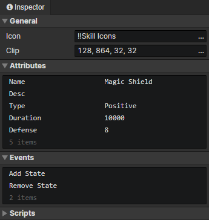

# File - State

### General

- Icon：State icon, loaded into the image element via the "Load Image" command
- Clip：Crop the specified rectangular area of the state icon

### Attributes

Support Boolean, Number, String, and Enumeration(String) types.  
Add custom attributes in "Window -> Object Attribute".  
Read or write state attributes via "Set Boolean", "Set Number", "Set String" commands.

### Events

Access "event trigger actor" in the event to get the actor with this state  
Access "event trigger state" in the event to get this state

- Add State：Triggered when an actor adds this state via "Change Actor State" command
- Remove State：Triggered when an actor removes this state with the "Change Actor State" command, or when the state times out
- Custom Events：Custom events can be called via the "Call Event" command

### Scripts

Add Javascript files to extend this state