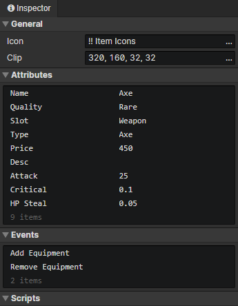

# File - Equipment

### General

- Icon：Equipment icon, loaded into the image element via the "Load Image" command
- Clip：Crop the specified rectangular area of the equipment icon

### Attributes

Support Boolean, Number, String, and Enumeration(String) types.  
Add custom attributes in "Window -> Object Attribute".  
Read or write equipment attributes via "Set Boolean", "Set Number", "Set String" commands.

### Events

Access "event trigger actor" in the event to get the actor with this equipment  
Access "event trigger equipment" in the event to get this equipment

- Create：Triggered at equipment initialization (once)
- Add Equipment：Triggered when an actor adds this equipment via "Change Actor Equipment" command
- Remove Equipment：Triggered when an actor removes this equipment with the "Change Actor Equipment" command
- Custom Events：Custom events can be called via the "Call Event" command

### Scripts

Add Javascript files to extend this equipment