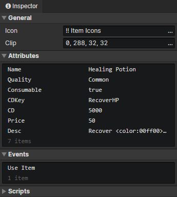

# File - Item

### General

- Icon：Item icon, loaded into the image element via the "Load Image" command
- Clip：Crop the specified rectangular area of the icon icon

### Attributes

Support Boolean, Number, String, and Enumeration(String) types.  
Add custom attributes in "Window -> Object Attribute".  
Read item attributes via "Set Boolean", "Set Number", "Set String" commands.
But item attributes cannot be written.

### Events

Access "event trigger actor" in the event to get the actor that uses this item  
Access "event trigger item" in the event to get this item

- Use Item：Triggered when an actor uses this item via "Use Item" command
- Custom Events：Custom events can be called via the "Call Event" command

### Scripts

Add Javascript files to extend this item