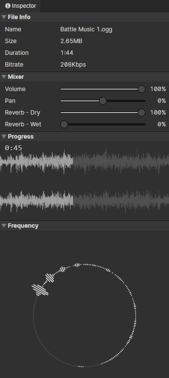

# File - Audio

### Mixer

The following are preview parameters

- Volume：Audio Gain (0 ~ 100%)
- Pan：-100% = left channel only, +100% = right channel only
- Reverb - Dry：The gain of the dry part of the reverberation, the smaller it is, the farther it is from the sound source
- Reverb - Wet：The gain of the wet part of the reverberation, simulating the sound reflection in a closed environment, the larger it is, the larger the closed space

### Progress

Real-time display of audio playback progress and waveform graph, click to jump to the specified playback time

### Frequency

Real-time display of the frequency of the sound being played