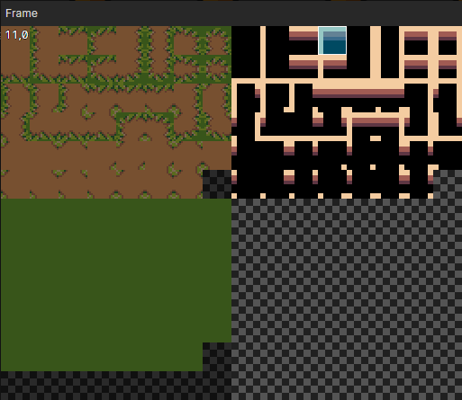

# File - Tile

### Palette

- Scrolling Mode：When on, slide the mouse wheel to scroll up and down the tileset, when off, zoom in and out the tileset
- Edit Mode：Open tileset editing mode
- Flip Tile：Flip the selected tile left and right, shortcut key (F)
- View Zoom：From left to right, the five scaling levels are 25%, 50%, 100%, 200% and 400%.

### Tileset

- Image：Enter an image of a normal tileset (this parameter is disabled if it is an auto tileset)
- Width：Number of horizontal tiles in the tileset
- Height：Number of vertical tiles in the tileset
- Tile Width：Number of horizontal pixels in a single tile
- Tile Height：Number of vertical pixels in a single tile
- Tile Offset X：Horizontal position offset of the tile drawn on the scene
- Tile Offset Y：Vertical position offset of the tile drawn on the scene
- Tile Priority：Sorting priority of tiles at rendering time, tiles positioned below will always override blocks above, priority only takes effect if the tile is set in the object layer tile map
  - Priority = -1 means that the sorting position is shifted up by one tile distance.
  - Priority = 1 means that the sorting position is shifted down by one tile distance.

### Edit Mode

Click on a tile and a number will appear, incremented by 1 for each click. this number represents the independent priority of the tile, the priority can be simply understood as the height.  
By setting the tile priority as shown, when the tree is drawn into the object layer tilemap, it will achieve the correct rendering order: when the actor is behind the tree, he will be obscured by the tree.  
Holding shift + mouse click will decrease the priority of the tiles.

### Set Auto Tile

If the tileset is an auto tile type, you can open the "Right-click menu -> Edit" at the location of the tile in edit mode, or click the "+" at the empty tile.

### Auto Tile - General

- Image：The image of the auto tile
- Offset X：Offset the horizontal selection position for all tiles, click on the right view to see the change after modification
- Offset Y：Offset the vertical selection position for all tiles, click on the right view to see the change after modification

### Auto Tile - View

Click on the view to open the "Select Tile Frame" window

### Auto Tile - Template List

Preset commonly used auto tiles

- Shift：Offset the selection position of all animation frames in the tile template by "right-click menu -> shift"

### Auto Tile - Branch List

Lists all the branches when setting up the auto tile into the scene

- Set Quantity：Adjust the number of tile branches via the "right-click menu -> set quantity"
- Set as Cover：Make a particular tile branch the display cover by "right-click menu -> Set as cover".

### Auto Tile - Adjacency Rule

When setting this tile into the scene, each block branch is checked in turn and the first block branch that meets the condition of the adjacency rule is set into the scene.

- Arrow：The adjacent tile is also a branch of this auto tile
- Cross：The adjacent tile is not a branch of this auto tile
- Blank：Unconditional, both cases are possible

### Auto Tile - Animation Frame List

If more than 1 animation frame is set, the tile animation will be played in a loop, the animation frame play interval can be modified by opening "Window -> Project Settings -> Scene"

- Generate：Select the animation frame and generate subsequent animation frames in batch by "right-click menu -> generate"

### Auto Tile - Select Tile Frame

Select a tile frame in the window as one of the animation frames of the current tile branch.  
The tiles in the left 8 columns are covered with a black shadow because "general -> offset x = 8" and the tiles in the black shadow are not selectable.  
You can put multiple auto tile images into one image, share the same tile template configuration, and then select different tile mapping by setting the offset X and offset Y.
