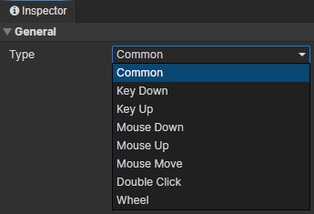
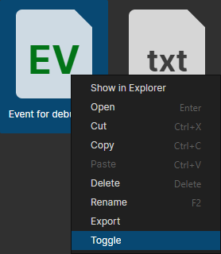

# File - Event

### General

Type
  - Common：Not automatically executed, triggered via the "call event" command
  - Key Down：Triggered when the keyboard is pressed, get the key code by "Set String" command, and check the key value by "Switch" command.
  - Key Up：Triggered when the keyboard is released, get the key code by "Set String" command, and check the key value by "Switch" command.
  - Mouse Down：Triggered when a mouse button is pressed. Get the button code by "Set Number" command and check the button code (0 ~ 4) by "Switch" command.
  - Mouse Up：Triggered when a mouse button is released. Get the button code by "Set Number" command and check the button code (0 ~ 4) by "Switch" command.
  - Mouse Move：Triggered when the mouse is moved over the scene
  - Double Click：Triggered when the mouse is double-clicked in the scene.
  - Wheel：Triggered when the mouse wheel slides up or down in the scene. Get the Delta Y of the mouse wheel by the "Set Number" command, if it is less than 0, it means slide up, if it is greater than 0, it means slide down.
  - Custom Events：Custom events can be called via plugins

:::tip

After calling the "Pause Game" command, the global events will stop triggering automatically.
You can set the specified event to the highest priority with the "Set Event" command to release the blocking state when pausing the game.

:::

### Toggle Event

Disable an event via "File Browser -> Event File -> Context Menu -> Toggle" and the event will not be triggered automatically.  
Events can also be toggled via "Set Event command -> Enable Global Event / Disable Global Event".

:::tip

If there are multiple sets of player control events, they can be switched in this way

:::