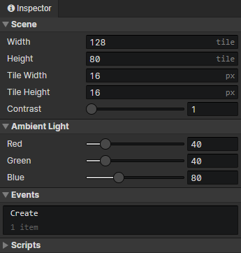

# Scene - Settings

Open this panel via the settings button in the scene toolbar

- Width：The number of horizontal grids in the scene (0-512).
- Height：The number of vertical grids in the scene (0-512).
- Tile Width：The width of the scene grid (16 - 256).
- Tile Height：The height of the scene grid (16 - 256).
- Contrast：The color factor of the screen after light synthesis, used to brighten colors in dark environments.
- Ambient Light - Red：Original color (red) \* Ambient Light (red) / 255 \* Contrast = Final color (red)
- Ambient Light - Green：Original color (green) \* Ambient Light (green) / 255 \* Contrast = Final color (green)
- Ambient Light - Blue：Original color (blue) \* Ambient Light (blue) / 255 \* Contrast = Final color (blue)
- Events：Destroying a scene will stop the execution of scene events.
  - Create：Triggered at scene initialization (once)
  - Autorun：Triggered when the scene is loaded (including after loading savedata)
- Scripts：Add Javascript files to extend this scene
