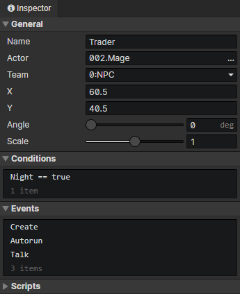

# Scene - Actor

### General

- Name：Scene actor name, no real use
- Actor：Use an actor file as data
- Team：The team of the actor
- X：The horizontal position of the actor in the scene
- Y：The vertical position of the actor in the scene
- Angle：The actor's angle, affect the animation direction, use "ctrl + up/down/left/right" to quickly set the angle of the selected actor
- Scale：The overall scaling of "actor animation" and "collision size", multiplied by the "scale" in the actor file.
  

### Conditions

When loading a scene, the actor will be created only when the conditions are met, each preset actor has a self variable that can be saved permanently.

### Events

Access "Event Trigger Actor" in the event to get this actor  
The events of the scene actor will overwrite the events of the same type in the actor file

- Create：Triggered at actor initialization (once)
- Autorun：Triggered when the actor appears in a scene (including after loading savedata)
- Collision：Triggered when a collision occurs between this actor and another actor. If the weight is 0, no collision occurs. Visit "Target Actor" in the event to get the actor that collided with this actor.
- Hit Trigger：When the actor is hit by a trigger, execute this event, and access "Event Trigger" in the event to get the trigger that collided with this actor.
- Custom Events：Custom events can be called via the "Call Event" command

### Scripts

Add Javascript files to extend this actor