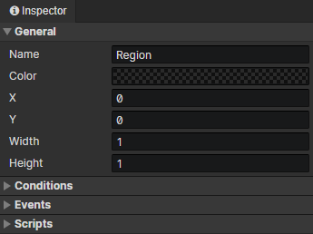

# Scene - Region

### General

- Name：Scene region name, no real use
- Color：Different colors can be set according to the role of the area
- X：The horizontal position of the area
- Y：The vertical position of the area
- Width：The width of the area
- Height：The height of the area

### Conditions

When loading a scene, the region will be created only when the conditions are met, each preset region has a self variable that can be saved permanently.

### Events

Access "Event Trigger Region" in the event to get this region

- Autorun：Triggered when the actor appears in a scene (including after loading savedata)
- Player Enter：Triggered when the player actor enters the region, access "Event Trigger Actor" in the event to get the relevant actor
- Player Leave：Triggered when the player actor leaves the region, access "Event Trigger Actor" in the event to get the relevant actor
- Actor Enter：Triggered when any actor enters the region, access "Event Trigger Actor" in the event to get the relevant actor
- Actor Leave：Triggered when any actor leaves the region, access "Event Trigger Actor" in the event to get the relevant actor
- Custom Events：Custom events can be called via the "Call Event" command

### Scripts

Add Javascript files to extend this actor