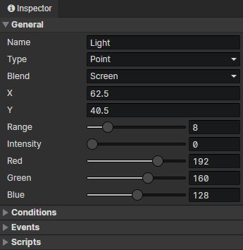
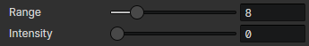
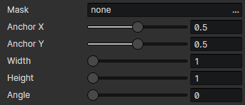

# Scene - Light

### General

- Name：Scene Light source name, no real use
- Type
  - Point：Light source with circular diffusion and attenuation from one point to the surrounding area, enable parameters (range, intensity)
  - Area：Using a texture as the light source, enable parameters (Mask, Anchor X, Anchor Y, Width, Height, Angle), it can be used to create a spotlight
- Blend：Screen、Additive、Subtract、Max
- X：The horizontal position of the light source in the scene
- Y：The vertical position of the light source in the scene
- Width：The width of the light source in the scene
- Height：The height of the light source in the scene

- Point Light - Parameters
  - Range：Diameter of light (0 ~ 128)
  - Intensity：The greater the intensity, the smaller the attenuation of the light source, the brighter
  - Red：The red component at the center of the point source
  - Green：The green component at the center of the point source
  - Blue：The blue component at the center of the point source

- Area Light - Parameters
  - Mask：The light is projected onto the scene through the mask image, and if it is not set, it is displayed as a rectangle
  - Anchor X：The horizontal position (0 ~ 1) of the mask image connection point of the light source.
  - Anchor Y：The vertical position (0 ~ 1) of the mask image connection point of the light source.
  - Width：The width of the rectangular area
  - Height：The height of the rectangular area
  - Angle：The rotation angle of the rectangular area
  - Red：Original color (red) \* Mask image color (red) \* Red / 255 = Final color (red)
  - Green：Original color (green) \* Mask image color (green) \* Green / 255 = Final color (green)
  - Blue：Original color (blue) \* Mask image color (blue) \* Blue / 255 = Final color (blue)

### Conditions

When loading a scene, the light source will be created only when the conditions are met, each preset light source has a self variable that can be saved permanently.

### Events

Access "Event Trigger Light" in the event to get this light

- Autorun：Triggered when the light source appears in a scene (including after loading savedata)
- Custom Events：Custom events can be called via the "Call Event" command

### Scripts

Add Javascript files to extend this light