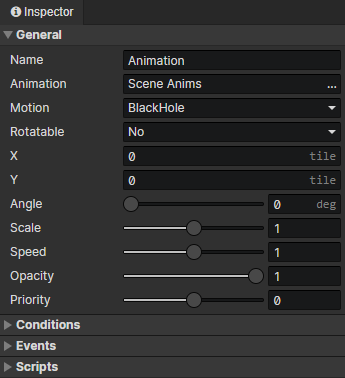

# Scene - Animation

### General

- Name：Scene animation name, no real use
- Animation：Bound animation file
- Motion：A motion in the bound animation file
- Rotatable：When turned on, the rotation angle of the animation will be set automatically
- X：The horizontal position of the animation in the scene
- Y：The vertical position of the animation in the scene
- Angle：The angle of the animation, which affects the "animation direction"
- Scale：Overall scaling factor of the animation
- Speed：The playback speed of the animation
- Opacity：Used to adjust the visibility of the animation in the scene
- Priority：Prioritize the animation when rendering, so that animations located below will always overlay those above.
  - Priority = -1 means that the sorting position is shifted up by one tile distance.
  - Priority = 1 means that the sorting position is shifted down by one tile distance.

### Conditions

When loading a scene, the animation will be created only when the conditions are met, each preset animation has a self variable that can be saved permanently.

### Events

- Autorun：Triggered when the animation appears in a scene (including after loading savedata)
- Custom Events：Custom events can be called via the "Call Event" command

### Scripts

Add Javascript files to extend this animation