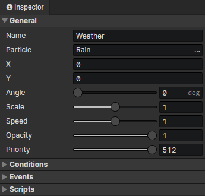

# Scene - Particle

### General

- Name：Scene Particle emitter name, no real use
- Particle：Bound particle file
- X：The horizontal position of the particle emitter in the scene
- Y：The vertical position of the particle emitter in the scene
- Angle：The angle of the particle emitter
- Scale：Overall scaling factor of particles
- Speed：Playback speed of particles
- Opacity：Used to adjust the visibility of particles in the scene
- Priority：Prioritize the particle emitter when rendering, so that particles located below will always override those above.
  - Priority = -1 means that the sorting position is shifted up by one tile distance.
  - Priority = 1 means that the sorting position is shifted down by one tile distance.

### Conditions

When loading a scene, the particle emitter will be created only when the conditions are met, each preset particle emitter has a self variable that can be saved permanently.

### Events

- Autorun：Triggered when the particle emitter appears in a scene (including after loading savedata)
- Custom Events：Custom events can be called via the "Call Event" command

### Scripts

Add Javascript files to extend this particle emitter