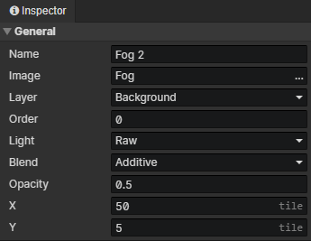
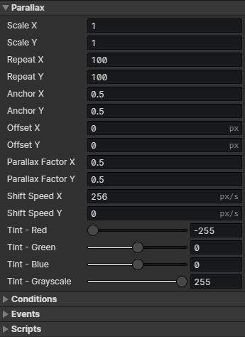

# Scene - Parallax

### General

- Name：Scene Parallax image name, no real use
- Image：Image file
- Layer：Background、Foreground
- Order：Parallaxes and tilemaps of the same layer are sorted by the "order" property, and when the "order" is equal, they are sorted by the order in which they appear in the scene object list
- Light
  - Raw：Unaffected by light
  - Global Sampling：Sampling light from multiple pixel locations where the image is located to composite the final color
  - Anchor Sampling：Sampling the light from the anchor position where the image is located to composite the final color
  - Ambient Light：Use the ambient light of the current scene to composite the final color.
- Blend：Normal、Additive、Subtract
- Opacity：Used to adjust the visibility of the parallax image in the scene
- X：The horizontal position of the parallax image in the scene
- Y：The vertical position of the parallax image in the scene

:::tip

Parallax images can be used to replace tilemaps.

:::

### Parallax

- Scale X：Horizontal scaling factor
- Scale Y：Vertical scaling factor
- Repeat X：Number of horizontal tiling
- Repeat Y：Number of vertical tiling
- Anchor X：Horizontal position of the connection point of the parallax (0 ~ 1)
- Anchor Y：Vertical position of the connection point of the parallax (0 ~ 1)
- Offset X：Horizontal offset distance
- Offset Y：Vertical offset distance
- Parallax Factor X：Horizontal distance factor of parallax shift when the camera moves
- Parallax Factor Y：Vertical distance factor of parallax shift when the camera moves
- Shift Speed X：Horizontal speed of parallax texture autoscroll (in pixels/sec).
- Shift Speed Y：Vertical speed of parallax texture autoscroll (in pixels/sec).
- Tint - Red：Original color (red) + Tint (red) = Final color (red)
- Tint - Green：Original color (green) + Tint (green) = Final color (green)
- Tint - Blue：Original color (blue) + Tint (blue) = Final color (blue)
- Tint - Grayscale：Grayscale is the opposite of saturation, the higher the grayscale the lower the saturation

### Conditions

When loading a scene, the parallax will be created only when the conditions are met, each preset parallax has a self variable that can be saved permanently.

### Events

- Autorun：Triggered when the parallax appears in a scene (including after loading savedata)
- Custom Events：Custom events can be called via the "Call Event" command

### Scripts

Add Javascript files to extend this parallax image