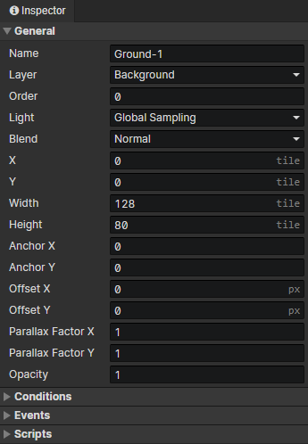

# Scene - Tilemap

### General

- Name：Scene Tilemap name, no real use
- Layer
  - Background：Enable parameter (light: ambient light)
  - Foreground：Enable parameter (light: ambient light)
  - Object：Enable parameter (light: anchor sampling)
- Order：Parallaxes and tilemaps of the same layer are sorted by the "order" property, and when the "order" is equal, they are sorted by the order in which they appear in the scene object list
- Light
  - Raw：Unaffected by light
  - Global Sampling：Sampling light from multiple pixel locations where the image is located to composite the final color
  - Anchor Sampling：Sampling the light from the anchor position where the image is located to composite the final color
  - Ambient Light：Use the ambient light of the current scene to composite the final color.
- Blend：Normal、Additive、Subtract
- X：The horizontal position of the tilemap in the scene
- Y：The vertical position of the tilemap in the scene
- Width：Number of horizontal tiles in the tilemap
- Height：Number of vertical tiles in the tilemap
- Anchor X：Horizontal position of the connection point of the tilemap (0 ~ 1)
- Anchor Y：Vertical position of the connection point of the tilemap (0 ~ 1)
- Offset X：Horizontal offset distance
- Offset Y：Vertical offset distance
- Parallax Factor X：Horizontal distance factor of tilemap shift when the camera moves
- Parallax Factor Y：Vertical distance factor of tilemap shift when the camera moves
- Opacity：Used to adjust the visibility of the tilemap in the scene

### Conditions

When loading a scene, the tilemap will be created only when the conditions are met, each preset tilemap has a self variable that can be saved permanently.

### Events

- Autorun：Triggered when the tilemap appears in a scene (including after loading savedata)
- Custom Events：Custom events can be called via the "Call Event" command

### Scripts

Add Javascript files to extend this tilemap