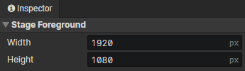

# UI - Settings

Open this panel via the settings button in the UI toolbar

- Width：The width of the UI stage container, which is only used for preview.
- Height：The height of the UI stage container, which is only used for preview.
