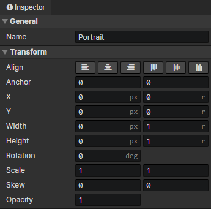
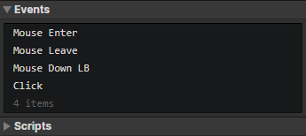

# UI - Common

### General

- Name：Element name, no real use

### Transform

- Align：Left, Center, Right, Top, Middle, Bottom
- Anchor：Horizontal + vertical positions of the element's connection point
- X：Horizontal position of the element in the container, pixel value + scale of the container width
- Y：Vertical position of the element in the container, pixel value + scale of the container height
- Width：Element width, pixel value + scale of container width
- Height：Element height, pixel value + scale of container height
- Rotation：Rotation angle of the element around the anchor point, right = 0 degrees, clockwise
- Scale：The horizontal + vertical scaling factors of the element, set to -1 is equal to the flipped
- Skew：Horizontal + vertical skew factors of the element
- Opacity：Used to adjust the visibility of the tilemap in the scene

### Events

- Autorun：Triggered when the element appears
- Mouse Down LB：Triggered when left mouse button is pressed
- Mouse Down RB：Triggered when right mouse button is pressed
- Mouse Down：Triggered when a mouse button is pressed. Get the button code by "Set Number" command and check the button code (0 ~ 4) by "Switch" command.
- Mouse Up LB：Triggered when left mouse button is released
- Mouse Up RB：Triggered when right mouse button is released
- Mouse Up：Triggered when a mouse button is released. Get the button code by "Set Number" command and check the button code (0 ~ 4) by "Switch" command.
- Mouse Move：Triggered when the mouse is moved over the element
- Mouse Enter：Triggered when the mouse enters the rectangular area of the element
- Mouse Leave：Triggered when the mouse leaves the rectangular area of the element
- Click：Triggered when the mouse is pressed in an element, stays inside the rectangular area of the element, then released
- Double Click：Triggered when the mouse is double-clicked in the element.
- Wheel：Triggered when the mouse wheel slides up or down in the element. Get the Delta Y of the mouse wheel by the "Set Number" command, if it is less than 0, it means slide up, if it is greater than 0, it means slide down.
- Input：A specific event for the text box, which will be triggered by entering text in the text box.
- Focus：A specific event for the text box, which will be triggered when the textbox is switched to input mode.
- Blur：A specific event for the text box, which will be triggered when the textbox exits input mode.
- Destroy：When the element is deleted by the "Delete Element" command, the event is triggered before it is deleted
- Custom Events：Custom events can be called via plugins

:::tip

For performance optimization reasons, if the position of an element is outside the parent element, clicking on the outside part will not trigger a pointer event, e.g., mouse down event.

:::

### Scripts

Add Javascript files to extend this element