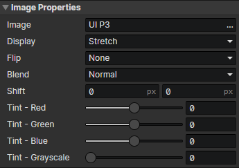

# UI - Image

### Image Properties

Modify image properties with the "Set Image" and "Tint Image" commands

- Image：Image File
- Display
  - Stretch：Enable Parameters (Flip, Shift X, Shift Y)
  - Tile：Enable Parameters (Flip, Shift X, Shift Y)
  - Clip：Enable Parameters (Flip, Clip), draw the image in the rectangular cropping area to the screen
  - Slice：Enable Parameters (Clip, Border), Cut the image into 9 parts according to the border size (4 corners, 4 edges, 1 center rectangle) and tile them into the element
- Flip
  - None
  - Horizontal
  - Vertical
  - Both
- Blend
  - Normal
  - Additive
  - Subtract
  - Mask：When mask mode is enabled, the overlapping part of the image in the child element and the current image will be rendered, color 1(RGB) \* color 2(RGB) / 255 = final color
- Shift X：Horizontal offset distance of the image texture (in pixels)
- Shift Y：Vertical offset distance of the image texture (in pixels)
- Clip：Crop the specified rectangular area
- Border：Cut the image into 9 parts according to the border size (4 corners, 4 edges, 1 center rectangle) and tile them into the element, border = the length of the square sides of the 4 corners
- Tint - Red：Original color (red) + Tint (red) = Final color (red)
- Tint - Green：Original color (green) + Tint (green) = Final color (green)
- Tint - Blue：Original color (blue) + Tint (blue) = Final color (blue)
- Tint - Grayscale：Grayscale is the opposite of saturation, the higher the grayscale the lower the saturation
