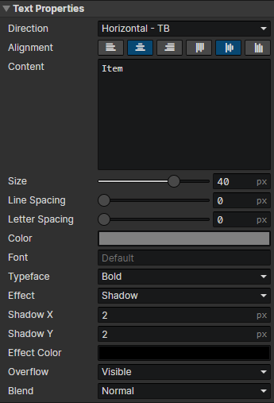

# UI - Text

### Text Properties

Modify text properties with the "Set Text" command

- Direction
  - Horizontal - TB：Text is arranged from left to right, with line feeds down
  - Vertical - LR：Text is arranged from top to bottom, with line feeds to the right
  - Vertical - RL：Text is arranged from top to bottom, with line feeds to the left
- Align：Left, Center, Right, Top, Middle, Bottom
- Content：Text content, insert rich text tags via "Right-click menu -> Tags"
- Size：Text font size (10 ~ 400)
- Line Spacing：Distance between lines of text (in pixels)
- Letter Spacing：Distance between each text in the same line (in pixels)
- Color：Initial color of the text
- Font：Enter the font name, separated by commas if there are multiple fonts, and list them in order of priority from left to right.
- Typeface：Regular, Bold, Italic, Bold Italic
- Effect
  - None
  - Shadow：Enable parameters (Shadow X, Shadow Y, Effect Color)
  - Stroke：Enable parameters (Stroke Width, Effect Color)
  - Outline：Similar to "stroke", the line width is fixed at 1 pixel, enable parameter (Effect Color)
- Shadow X：Horizontal offset distance of text shadow (in pixels)
- Shadow Y：Vertical offset distance of text shadow (in pixels)
- Stroke Width：The width of the text stroke line, half of which is obscured inside the text and the other half outside.
- Effect Color：Shadow / stroke / outline color
- Overflow
  - Visible：Allow text to appear outside of the element
  - Wrap：When text is printed to the edge of the element, it will continue to be print on a new line, affected by "Project Settings -> Text -> Wrap (break / keep)"
  - Truncate：Stop printing overflow text after a line break
  - Wrap Truncate：Both "wrap" and "truncate" are available
- Blend：Normal, Additive, Subtract
