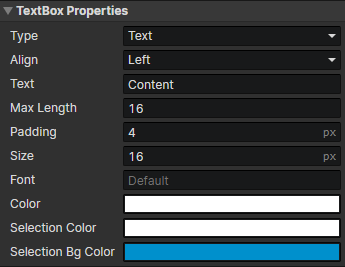

# UI - Text Box

### Text Box Properties

Modify text box properties with the "Set Text Box" command

- Type
  - Text：Enable parameters (Text, Max Length)
  - Number：Enable parameters (Number, Min, Max, Decimal Places)
- Align：Left, Center, Right
- Text：The text content of the element read by "Set String" command
- Max Length：Maximum number of allowed text characters
- Number：The numerical value of the element, read by "Set Number" command
- Min：Minimum value allowed
- Max：Maximum value allowed
- Decimal Places：The maximum number of decimal places allowed
- Padding：The left and right paddings of the text box, which affect the width of the input area
- Size：Font size
- Font：Enter the font name, separated by commas if there are multiple fonts, and list them in order of priority from left to right.
- Color：Text color
- Selection Color：Text color of the selected section
- Selection Bg Color：Background color of the selected section
