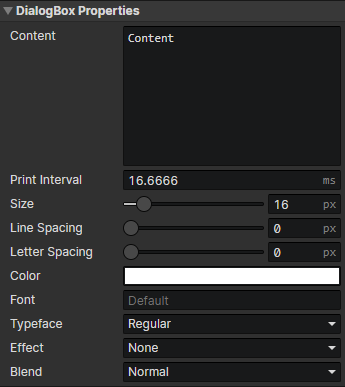

# UI - Dialog Box

### Dialog Box Properties

Modify dialog box properties by "Set Dialog Box" command  
Control dialog printing by "Control Dialog Box" command

- Content：Text content, insert rich text tags via "Right-click menu -> Tags"
- Print Interval：If set to 0, all text is printed directly, otherwise, text is printed at fixed intervals until the end of printing or the current page is filled.
- Size：Text font size (10 ~ 400)
- Line Spacing：Distance between lines of text (in pixels)
- Letter Spacing：Distance between each text in the same line (in pixels)
- Color：Initial color of the text
- Font：Enter the font name, separated by commas if there are multiple fonts, and list them in order of priority from left to right.
- Typeface：Regular, Bold, Italic, Bold Italic
- Effect
  - None
  - Shadow：Enable parameters (Shadow X, Shadow Y, Effect Color)
  - Stroke：Enable parameters (Stroke Width, Effect Color)
  - Outline：Similar to "stroke", the line width is fixed at 1 pixel, enable parameter (Effect Color)
- Shadow X：Horizontal offset distance of text shadow (in pixels)
- Shadow Y：Vertical offset distance of text shadow (in pixels)
- Stroke Width：The width of the text stroke line, half of which is obscured inside the text and the other half outside.
- Effect Color：Shadow / stroke / outline color
- Blend：Normal, Additive, Subtract
