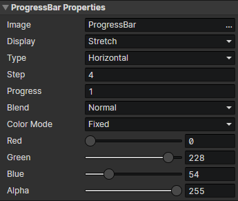

# UI - Progress Bar

### Progress Bar Properties

Modify progress bar properties by "Set Progress Bar" command

- Image：Image File
- Display
  - Stretch
  - Clip：Enable Parameter (Clip)
- Clip：Crop the specified rectangular area
- Type
  - Horizontal
  - Vertical
  - Circular：Enable parameters (Center X, Center Y, Start Angle, central Angle)
- Center X：Center X of the circular progress bar
- Center Y：Center Y of the circular progress bar
- Start Angle：Start angle of the circular progress bar, right = 0 degrees, clockwise
- Central Angle：The angle at the end of the circular progress bar minus the angle at the beginning
- Step：The texture sampling length of the horizontal / vertical progress bar is an integer multiple of the step，The texture sampling angle of the circular progress bar is an integer multiple of the step，Step = 0 means disable
- Progress：Initial progress of progress bar (0 ~ 1)
- Blend
  - Normal
  - Additive
  - Subtract
- Color Mode
  - Texture Sampling：Use the pixel colors in the progress bar image
  - Fixed：Replace the pixel color in the progress bar image with the specified color, enable parameters (red, green, blue, opacity)
- Red：Red component of the progress bar color in fixed color mode
- Green：Green component of the progress bar color in fixed color mode
- Blue：Blue component of the progress bar color in fixed color mode
- Alpha：Alpha component of the progress bar color in fixed color mode
