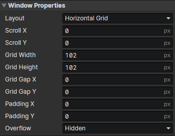

# UI - Window

### Window Properties

- Layout
  - Normal：Just as an element container
  - Horizontal Grid：Grids are arranged from left to right, with line feeds down
  - Vertical Grid：Grids are arranged from top to bottom, with line feeds to the right
- Scroll X：The initial horizontal scroll position of the window (in pixels)
- Scroll Y：The initial vertical scroll position of the window (in pixels)
- Grid Width：Horizontal size of a single grid (in pixels)
- Grid Height：Vertical size of a single grid (in pixels)
- Grid Gap X：Horizontal spacing (in pixels) between adjacent grids.
- Grid Gap Y：Vertical spacing (in pixels) between adjacent grids.
- Padding X：Horizontal inner padding of the window (in pixels)
- Padding Y：Vertical inner padding of the window (in pixels)
- Overflow
  - Visible：Display the content of child elements outside the window
  - Hidden：Hide the content of child elements outside the window
