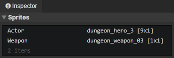

# Animation - Settings

Open this panel via the settings button in the animation toolbar

- Sprite Asset List：Set spritesheet name, image file, horizontal divisions, vertical divisions, and you can load the spritesheet in the sprite layer. The spritesheet image in the actor animation can be replaced.