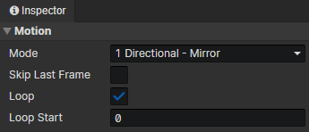

# Animation - Motion

### Motion

- Mode
  - 1 Directional
  - 2 Directional：Left, Right
  - 4 Directional：Down, Left, Right, Up
  - 8 Directional：Down, Left, Right, Up, Down Left, Down Right, Up Left, Up Right
  - 1 Directional - Mirror：Right, Mirror (Left)
  - 3 Directional - Mirror：Down, Right, Up, Mirror (Left)
  - 5 Directional - Mirror：Down, Right, Up, Down Right, Up Right, Mirror (Left, Down Left, Up Left)
- Skip Last Frame：Skip when the animation plays to the last frame.
- Loop：Return to the start frame at the end of the animation and resume playback
- Loop Start：Start frame of the animation loop