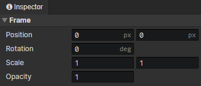

# Animation - Joint Frame

### Joint Frame

- Position：Horizontal / vertical position of the joint (in pixels)
- Rotation：Right = 0 degrees, clockwise
- Scale：Horizontal and vertical scaling, Scale X (-1), equal to horizontal flip, Scale Y (-1), equal to vertical flip
- Opacity：0 ~ 1

:::tip

The joint layer can have other layers as its child layers, and then set the frame parameters to move, scale and rotate all the child layers as a whole

:::
