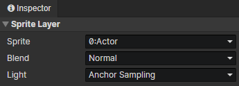

# Animation - Sprite Layer

### Sprite Layer

- Sprite：Select a preset sprite in the "Animation Settings".
- Blend：Normal, Additive, Subtract
- Light：The effect is not visible when previewing in the stage
  - Raw：Unaffected by light
  - Global Sampling：Sampling light from multiple pixel locations where the image is located to composite the final color
  - Anchor Sampling：Sampling the light from the anchor position where the image is located to composite the final color

:::tip

Light sampling: it is recommended to use "Anchor Sampling" for actor sprites and "Raw" for skill sprites

:::