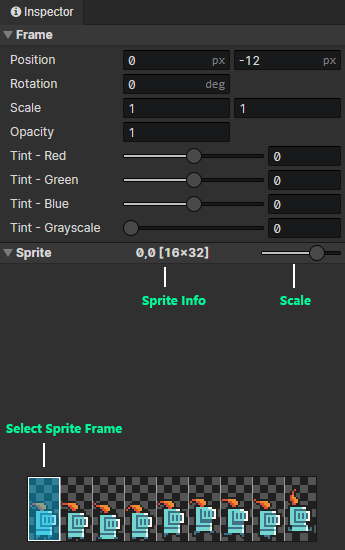

# Animation - Sprite Frame

### Sprite Frame

- Position：Horizontal / vertical position of the sprite (in pixels)
- Rotation：Right = 0 degrees, clockwise
- Scale：Horizontal and vertical scaling, Scale X (-1), equal to horizontal flip, Scale Y (-1), equal to vertical flip
- Opacity：0 ~ 1
- Tint - Red：Original color (red) + Tint (red) = Final color (red)
- Tint - Green：Original color (green) + Tint (green) = Final color (green)
- Tint - Blue：Original color (blue) + Tint (blue) = Final color (blue)
- Tint - Grayscale：Grayscale is the opposite of saturation, the higher the grayscale the lower the saturation

:::tip

Sprite anchor: fixed in the center of the sprite, you can make the sprite layer as a child layer of the joint layer, to achieve the effect of changing the anchor point.

:::

### Sprite

- View Zoom：From left to right, the five scaling levels are 25%, 50%, 100%, 200% and 400%.  
- Select the sprite frame: press the left mouse button, or up / down / left / right key, to select the sprite frame