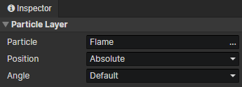

# Animation - Particle Layer

### Particle Layer

- Particle：Particle File
- Position
  - Absolute：The position of the emitted particles is not affected by the animation
  - Relative：The emitted particles move with the animation
- Angle
  - Default：The particles will be emitted at preset angles
  - Inherit：The angle of particle emission is affected by the animation rotation angle
