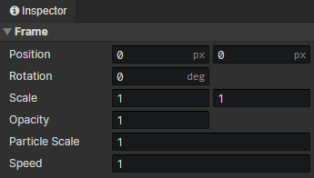

# Animation - Particle Frame

### Particle Frame

- Position：Horizontal / vertical position of the particle emitter (in pixels)
- Rotation：Right = 0 degrees, clockwise
- Scale：Horizontal and vertical scaling, Scale X (-1), equal to horizontal flip, Scale Y (-1), equal to vertical flip
- Opacity：0 ~ 1
- Particle Scale：Horizontal and vertical scaling factor of particles
- Speed：Playback speed of particles
