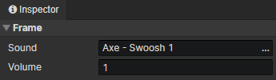

# Animation - Sound Frame

### Sound Frame

- Sound：Audio File
- Volume：Maximum volume of the sound effect (0 ~ 1)

:::tip

The sound effect played through the animation sound layer is attenuated.  
The farther the camera is from the animation position, the lower the volume.  
If the distance is too far, the sound will not be played.

:::
