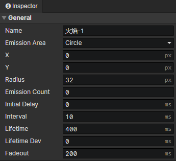
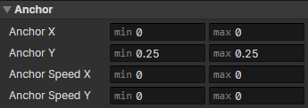
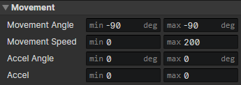
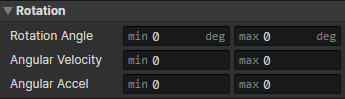
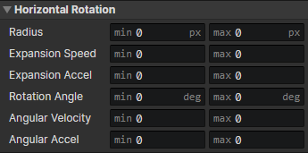
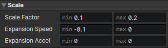
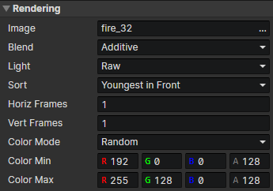

# Particle - Layer

### General

- Name：Particle layer name
- Emission Area：
  - Point：Particles are emitted from a point, enable parameters (X, Y)
  - Rectangle：Particles are emitted from a random position inside a rectangle, enable parameters (X, Y, Width, Height)
  - Circle：Particles are emitted from a random position inside a circle, enable parameters (X, Y, Radius)
  - Screen Edge：Particles are emitted from the edge of the screen, the emission position is related to the initial movement angle, suitable for making weather effects
- Emission Count：Stop emitting particles after the specified number of particles have been emitted. If set to 0, there is no limit to the number.
- Initial Delay：Delay the time to emit particles.
- Interval：The emission interval time of the particles.
- Lifetime：The time from emission to destruction of the particle.
- Lifetime Dev：Lifetime ± Lifetime time deviation (random) = Final lifetime
- Fadeout：Time for particles to transition to transparency before destruction

### Anchor

- Anchor X：Horizontal position of the particle connection point
- Anchor Y：Vertical position of the particle connection point
- Anchor Speed X：Change in "Anchor X" per second
- Anchor Speed Y：Change in "Anchor Y" per second

:::tip

The anchor point (0, 0) is at the center of the particle

:::

### Movement

- Movement Angle：The angle of the initial speed of a particle
- Movement Speed：The initial speed of a particle
- Accel Angle：Change in "movement angle" per second
- Accel：Change in "movement speed" per second

### Rotation

- Rotation Angle：Initial angle of the particle
- Angular Velocity：Change in "rotation angle" per second
- Angular Accel：Change in "angular velocity" per second

### Horizontal Rotation

- Radius：Amplitude of the particle moving left and right, used to simulate rotation around the Y-axis
- Expansion Speed：Change in "radius" per second
- Expansion Accel：Change in "expansion speed" per second
- Rotation Angle：Angle from the Y axis to the current position of the particle after horizontal rotation, right = 0 degrees, clockwise rotation
- Angular Velocity：Change in "rotation angle" per second
- Angular Accel：Change in "angular velocity" per second

### Scale

- Scale Factor：Scale factor for particle size, 1 = 100%.
- Expansion Speed：Change in "scale factor" per second
- Expansion Accel：Change in "expansion speed" per second

### Rendering

- Image：Spritesheet Image file
- Blend：Normal, Additive, Subtract
- Light
  - Raw：Unaffected by light
  - Global Sampling：Sampling light from multiple pixel locations where the image is located to composite the final color
  - Ambient Light：Use the ambient light of the current scene to composite the final color.
- Sort：
  - Youngest in Front：The newly generated particles are displayed in front of the old ones.
  - Oldest in Front：The old particles are displayed in front of the newly generated particles
  - By Scale Factor：Particles with larger scaling factors are displayed in front
- Horizontal Frames：The number of horizontal frames of the spritesheet, randomly selected a column when generating particles
- Vertical Frames：The number of vertical frames of the spritesheet, randomly selected a row when generating particles
- Color Mode：
  - Fixed：Enable parameter (Color)
  - Random：Enable parameters (Color Min, Color Max)
  - Easing：Enable parameters (Color Easing, Color Start Min, Color Start Max, Color End Min, Color End Max)
  - Texture Sampling：Enable parameters (Tint - Red, Tint - Green, Tint - Blue, Tint - Grayscale)