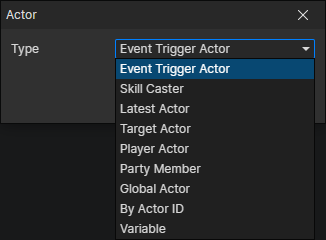

# Actor Getter

### Parameters

- Type
  - Event Trigger Actor：The actor that triggered this event, for example
    - The actor who owns this event
    - The actor who used the item
    - The actor who added the equipment
    - The actor who cast the skill
    - The actor who got the state
  - Skill Caster：Accessible in the "Cast Skill" event, as well as in all trigger events
  - Latest Actor：Get the latest created actor, which refreshes when the "Create Actor" or "Create Global Actor" command is called.
  - Target Actor：A container for temporary storage of an actor
    - Access it in the "Collision" event to get another actor that collided with "Event Trigger Actor"
    - After calling the "Detect Targets" command, it will be set to an eligible actor in the target actor pool, which may not exist (none).
    - After calling the "Show Text" command, it is set to the actor read by the "actor accessor" in the command, which may not exist (none).
  - Player Actor：Set the initial player actor via "Project Settings -> Actor -> Player Actor". Modify via "Set Player Actor" command
  - Party Member：Get the actor in the player's party, enable parameter (Index)
  - Global Actor：Get the existing global actor by actor file id, enable parameter (Actor File)
  - By Actor ID：Get a preset actor in the current scene, enable parameter (Data ID)
  - Variable：Get the actor from the specified variable, enable parameter (Variable)
