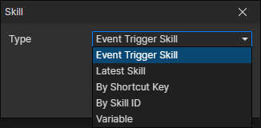

# Skill Getter

### Parameters

- Type
  - Event Trigger Skill：When a skill event is triggered, get this skill through it
  - Latest Skill：Get the latest created skill, which refreshes when the "Change Actor Skill" command is called
  - By Shortcut Key：Get the skill in the shortcut bar of the specified actor, enable parameters (Actor, Shortcut Key)
  - By Skill ID：Get the skill corresponding to the skill file ID of the specified actor, enable parameters (Actor, Skill File)
  - Variable：Get the skill from the specified variable, enable parameter (Variable)
