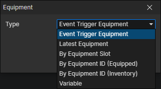

# Equipment Getter

### Parameters

- Type
  - Event Trigger Equipment：When an equipment event is triggered, get this equipment through it
  - Latest Equipment：Get the latest created equipment, which refreshes when the "Change Actor Equipment" command is called
  - By Equipment ID (Equipped)：Get the equipment corresponding to the equipment file ID from the slots of the specified actor, enable parameters (Actor, Equipment File)
  - By Equipment ID (Inventory)：Get the equipment corresponding to the equipment file ID from the inventory of the specified actor, enable parameters (Actor, Equipment File)
  - Variable：Get the equipment from the specified variable, enable parameter (Variable)
