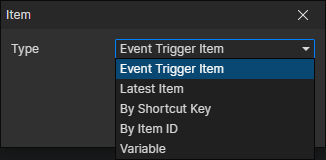

# Item Getter

### Parameters

- Type
  - Event Trigger Item：When an item event is triggered, get this item through it
  - Latest Item：Get the latest acquired item, which refreshes when the "Set Inventory" command is called to add items
  - By Shortcut Key：Get the item in the shortcut bar of the specified actor, enable parameters (Actor, Shortcut Key)
  - By Item ID：Get the item corresponding to the item file ID of the specified actor, enable parameters (Actor, Item File)
  - Variable：Get the item from the specified variable, enable parameter (Variable)
