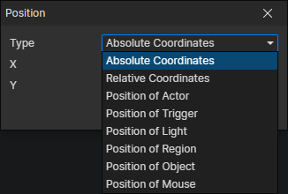

# Position Getter

### Parameters

- Type
  - Absolute Coordinates：Specify the scene coordinates (X, Y)
  - Relative Coordinates：Specify the relative coordinates (X, Y) of the current object position, valid only in some cases
  - Position of Actor：Get the position of the actor
  - Position of Trigger：Get the position of the trigger
  - Position of Light：Get the position of the light
  - Position of Region：Get the position of the region
  - Position of Object：Get the position of a preset object in the current scene
  - Position of Mouse：Get the position of the mouse pointer
  